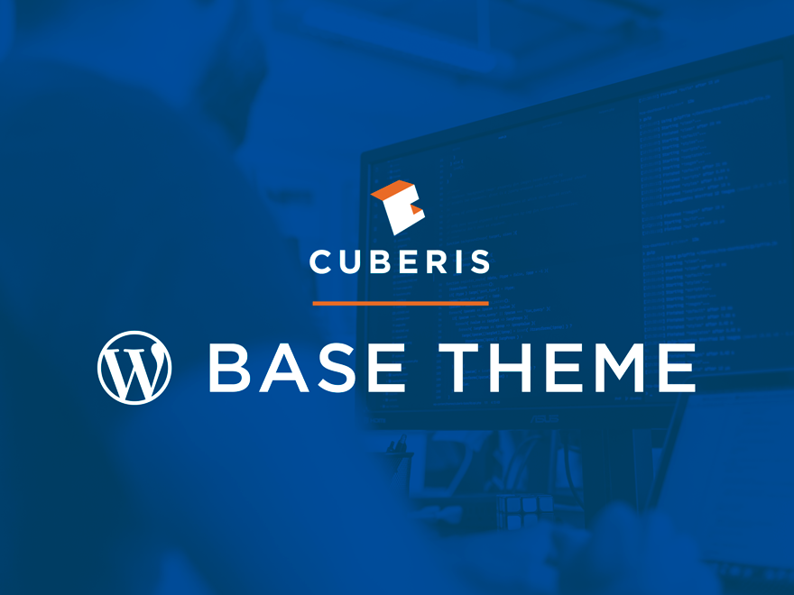

# Cuberis Base Theme

The Cuberis Base theme is a modern WordPress starter theme built on top of [Sage](https://roots.io/sage/) and modified to our project and development processes.

## Requirements
| Prerequisite    | How to check | How to install
| --------------- | ------------ | ------------- |
| PHP >= 5.4.x    | `php -v`     | [php.net](https://php.net/manual/install.php) |
| Node.js >= 6.0  | `node -v`    | [nodejs.org](https://nodejs.org/) |
| npm             | `npm -v`     | [npm.org](https://www.npmjs.com/) |

[Composer](https://getcomposer.org) is optional but available should you need to include additional PHP libraries to extend the theme's functionality.

Additionally, [Advanced Custom Fields PRO](https://www.advancedcustomfields.com/pro/) is a plugin requirement for utilizing components in your project.

## Features
* [Laravel Mix](https://github.com/JeffreyWay/laravel-mix)
* [Browsersync](https://browsersync.io)
* [Bootstrap](https://getbootstrap.com/)
* [Theme wrapper](https://roots.io/sage/docs/theme-wrapper/)
* ARIA roles and microformats
* Posts use the [hNews](http://microformats.org/wiki/hnews) microformat
* [Multilingual ready](https://roots.io/wpml/) and over 30 available [community translations](https://github.com/roots/sage-translations)

## Theme Installation
1. [Download the master branch](https://github.com/cuberis/cuberis-base/archive/master.zip) of this repo.
2. Unzip theme in wp-content/themes/.
3. Rename theme to your project name and activate!

## Theme Functionality
`functions.php` is used to include files from the lib/ directory which contains all of the theme functionality. Don’t place any custom code in this file—use it only for includes. PHP code is namespaced.

* **assets.php**: Enqueue stylesheets and scripts.
* **customizer.php**: Add customizer fields.
* **extras.php**: Contains helper functions, including `componify()`.
* **setup.php**: Enable/disable theme features, set config values, register nav menus, sidebars, and define theme support for WordPress core functionality such as post thumbnails, post formats, and HTML5 markup.
* **titles.php**: Control the output of page titles.
* **types.php**: Register custom post types and taxonomies.
* **wrapper.php**: DRY theme wrapper. Read more info about [Sage’s theme wrapper](https://roots.io/sage/docs/theme-wrapper/).

Add additional lib includes as needed.

## Development

### Available build commands
* `npm run dev` — Compile assets with source maps
* `npm run watch` — Fire up Browsersync, watch CSS and JS for changes
* `npm run production` — Bundle assets for production

## Wiki
{{ TBD }}
* Components
* Local dev environments
* Recommended plugins
* Adding CSS / JS libraries
* Deployment / DeployHQ

## Sage Documentation
* Source: [https://github.com/roots/sage](https://github.com/roots/sage)
* Homepage: [https://roots.io/sage/](https://roots.io/sage/)
* Documentation: [https://roots.io/sage/docs/](https://roots.io/sage/docs/)
